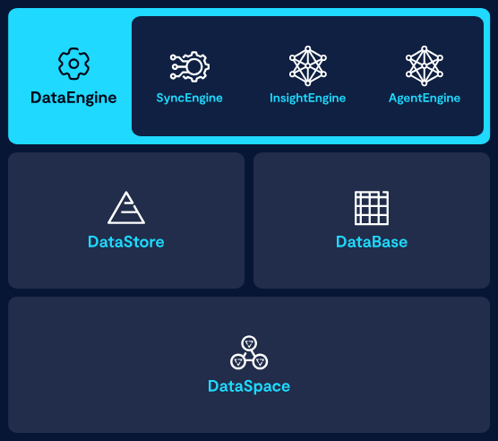

<p align="center"></p>

# VAST DataEngine Pipelines

A curated list of DataEngine pipeline examples — spanning reference pipelines from the VAST GitHub org and community contributions.

## What is VAST DataEngine?

[VAST DataEngine](https://www.vastdata.com/platform/dataengine) is a serverless computing platform built into the VAST [AI Operating System](https://www.vastdata.com/platform/ai-os):

<p align="center"></p>

DataEngine lets you build, deploy, and scale data processing functions without managing infrastructure, running compute directly where data lives to eliminate costly data movement and duplication. The platform handles scheduling, event detection, and resource allocation so you can focus on business logic. At its core, DataEngine gives you three building blocks:
- **Functions:** Your code built into container images and executed on VAST compute nodes (cnodes)
- **Triggers:** Event sources like S3 uploads or cron schedules
- **Pipelines:** Orchestration layer that connects triggers to functions

For a full overview, check out our recent blog post: [VAST DataEngine: Bringing Compute to Your Data](https://www.vastdata.com/blog/vast-dataengine-bringing-compute-to-your-data)

---

## Pipelines

> **Disclaimer:** The pipelines listed here are provided for demonstration and educational purposes only. They are not guaranteed to be production-ready. Review, test, and harden any pipeline to meet your own requirements before deploying it in a production environment.

### In this repo

Small, self-contained pipelines intended for training and workshop use:

| Pipeline | Trigger | Runtime | Description |
|---|---|---|---|
| [python-cron-hello-world](python-cron-hello-world/) | Cron | Python 3.11 | Hello world triggered on a cron schedule |

### Reference Pipelines 

Reference pipelines by VAST:

| Pipeline | Runtime | Repo | Description |
|---|---|---|---|

### Community

Pipelines built and maintained by the community:

| Pipeline | Runtime | Repo | Author | Description |
|---|---|---|---|---|

---

## Contributing

See [CONTRIBUTING.md](CONTRIBUTING.md) for the full workflow and PR checklist.

To contribute, add an entry to [`registry.json`](registry.json) and open a PR against `main`.

---

## Folder layout

```
dataengine-pipelines/
├── python-cron-hello-world/        # Small, self-contained training pipeline
├── scripts/
│   └── validate_function.py        # Checks a function folder has all required files
└── registry.json                   # Machine-readable index of all pipelines
```
